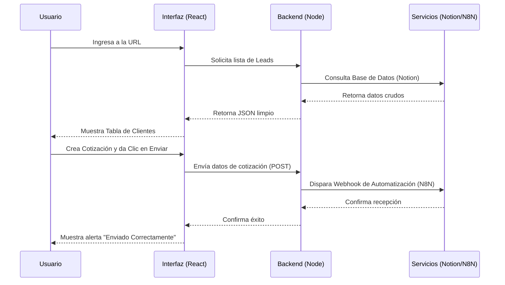
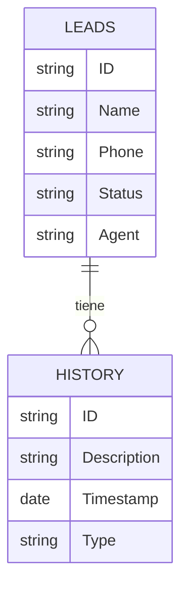

# Manual Técnico Maestro: DASHBOARD CON IA

Este documento es la referencia definitiva del sistema. Cubre desde la arquitectura de alto nivel hasta la explicación línea por línea de la infraestructura, diseñado para capacitar completamente a un nuevo desarrollador o arquitecto de software.

---

## 1. Arquitectura del Sistema

El sistema opera bajo una arquitectura de **Microservicios Contenerizados**. No es una aplicación monolítica; son piezas independientes que trabajan juntas.

### Diagrama de Arquitectura Global

```mermaid
graph TD
    subgraph "Cliente (Navegador)"
        Browser[Navegador del Usuario]
        PDFLib[Librería jsPDF (Generación Local)]
    end

    subgraph "Servidor de Aplicaciones (Docker Host)"
        Nginx[Nginx (Reverse Proxy & Web Server)]
        ReactApp[React App (Archivos Estáticos)]
        NodeServer[Node.js Backend API]
    end

    subgraph "Servicios Externos (Nube)"
        Notion[Notion API (Base de Datos)]
        N8N[N8N (Automatización de Flujos)]
    end

    Browser -->|HTTP/HTTPS| Nginx
    Nginx -->|Sirve Archivos| ReactApp
    Nginx -->|Proxy /api| NodeServer
    
    NodeServer -->|Lectura/Escritura| Notion
    NodeServer -->|Webhook POST| N8N
    
    Browser -.->|Genera| PDFLib
```

### Relación Humano ↔ Aplicación



---

## 2. Mapa de Estructura de Carpetas

Este mapa explica qué hace cada rincón del proyecto.

```text
/ (Raíz del Proyecto)
├── .env                    # [SECRETO] Variables de entorno (Claves de API). NO SUBIR A GITHUB.
├── docker-compose.yml      # Orquestador. Define cómo levantar Frontend y Backend juntos.
├── nginx.conf              # Configuración del servidor web. Maneja el tráfico y el Proxy.
├── package.json            # Dependencias del Frontend (React, Vite, Tailwind).
├── index.html              # Punto de entrada de la aplicación web.
├── vite.config.ts          # Configuración del empaquetador Vite.
│
├── backend/                # [MICROSERVICIO] Servidor API
│   ├── Dockerfile          # Instrucciones para construir la imagen del servidor.
│   ├── package.json        # Dependencias del Backend (Express, Notion Client).
│   └── server.js           # Lógica del servidor. Rutas, validaciones y conexión a Notion.
│
├── src/                    # Código Fuente del Frontend
│   ├── App.tsx             # Componente raíz. Decide qué mostrar (Ventas vs Cotizaciones).
│   ├── main.tsx            # Punto de montaje de React en el DOM.
│   │
│   ├── components/         # Bloques de construcción de la UI
│   │   ├── Header.tsx      # Barra superior.
│   │   ├── QuotesView.tsx  # [CRÍTICO] Formulario de cotización y lógica de envío.
│   │   ├── Chatbot.tsx     # Widget flotante de N8N.
│   │   └── ... (Sidebars, etc.)
│   │
│   └── services/           # Lógica de Negocio (Sin UI)
│       ├── notionService.ts # Funciones para hablar con nuestro Backend.
│       ├── pdfService.ts    # Lógica matemática y visual para crear el PDF.
│       └── geminiService.ts # (Experimental) Integración con IA.
│
└── public/                 # Archivos estáticos públicos (imágenes, favicons).
```

---

## 3. Lógica de Negocio (Pseudocódigo)

### Proceso: Enviar Cotización (Webhook)

**Regla de Negocio**: Una cotización solo se envía si hay un cliente seleccionado y productos agregados.

```pseudocode
FUNCION EnviarCotizacion(cliente, productos):
    SI cliente ES NULO O productos ESTA_VACIO:
        RETORNAR Error("Faltan datos")

    total = CALCULAR_TOTAL(productos)
    
    payload = {
        "cliente": cliente.nombre,
        "telefono": cliente.telefono,
        "productos": productos,
        "total": total,
        "fecha": AHORA()
    }

    INTENTAR:
        respuesta = HACER_POST("/api/webhook", payload)
        SI respuesta.status == 200:
            MOSTRAR_ALERTA("Éxito")
            LIMPIAR_FORMULARIO()
        SINO:
            MOSTRAR_ERROR("Error en el servidor")
    CAPTURAR Error:
        MOSTRAR_ERROR("Fallo de red")
FIN FUNCION
```

### Proceso: Generar Reporte Diario (PDF)

**Regla de Negocio**: El reporte debe mostrar todas las actividades del día. Si una fecha es inválida, no debe romper el reporte, sino mostrar "--:--".

```pseudocode
FUNCION GenerarPDF(historial):
    actividades_hoy = FILTRAR(historial, item => item.fecha == HOY)
    
    doc = NUEVO_PDF()
    DIBUJAR_ENCABEZADO(doc, "Reporte Diario")
    
    PARA CADA item EN actividades_hoy:
        hora = FORMATEAR_HORA(item.fecha)
        
        # Regla de Seguridad
        SI hora CONTIENE "Invalid":
            hora = "--:--"
            
        FILA = [hora, item.cliente, item.descripcion]
        AGREGAR_TABLA(doc, FILA)
        
    GUARDAR_PDF(doc, "Reporte_Diario.pdf")
FIN FUNCION
```

---

## 4. Infraestructura Línea por Línea

### `backend/Dockerfile`
Este archivo crea la "computadora virtual" donde vive el servidor.

```dockerfile
FROM node:18-alpine           # 1. Usa una versión ligera de Linux con Node.js instalado.
WORKDIR /app                  # 2. Crea una carpeta /app dentro del contenedor.
COPY package*.json ./         # 3. Copia los archivos de dependencias.
RUN npm install               # 4. Instala las librerías (Express, Notion, etc.).
COPY . .                      # 5. Copia el resto del código (server.js).
EXPOSE 3001                   # 6. Avisa que usará el puerto 3001.
CMD ["node", "server.js"]     # 7. Comando de inicio: arranca el servidor.
```

### `docker-compose.yml`
El director de orquesta.

```yaml
version: '3.8'
services:
  erp-dashboard:              # Servicio 1: Frontend
    build: .                  # Construye usando el Dockerfile de la raíz.
    ports:
      - "8081:80"             # Conecta puerto 8081 (PC) -> 80 (Nginx).
    depends_on:
      - backend               # Espera a que el backend arranque primero.

  backend:                    # Servicio 2: API
    build: ./backend          # Construye usando backend/Dockerfile.
    ports:
      - "3001:3001"           # Conecta puerto 3001 (PC) -> 3001 (Node).
    environment:              # Inyecta las claves secretas.
      - NOTION_API_KEY=${VITE_NOTION_API_KEY}
```

---

## 5. GitHub y Control de Versiones

El repositorio es el historial de vida del proyecto.

*   **Rama `main`**: Es la versión "Sagrada". El código aquí siempre debe funcionar. Es lo que está en producción.
*   **Commits**: Cada cambio guardado.
    *   *Ejemplo*: "fix: corregir error de fecha en PDF"
*   **Remote (`origin`)**: La copia del código en la nube (GitHub).

**Flujo de Trabajo Estándar:**
1.  `git pull origin main`: Bajar los últimos cambios de la nube.
2.  *Hacer cambios en el código...*
3.  `git add .`: Preparar los cambios.
4.  `git commit -m "Descripción"`: Guardar los cambios en local.
5.  `git push origin main`: Subir los cambios a la nube.

---

## 6. Guía de Despliegue (Deployment)

Para poner esto en internet (VPS como DigitalOcean, AWS, etc.):

1.  **Alquilar Servidor**: Obtén un servidor Ubuntu.
2.  **Instalar Docker**:
    ```bash
    sudo apt update
    sudo apt install docker.io docker-compose
    ```
3.  **Clonar Repositorio**:
    ```bash
    git clone https://github.com/TU_USUARIO/DASHBOARD.git
    cd DASHBOARD
    ```
4.  **Configurar Secretos**:
    Crear el archivo `.env` en el servidor (porque git no lo sube).
    ```bash
    nano .env
    # Pegar tus claves API aquí
    ```
5.  **Lanzar**:
    ```bash
    sudo docker-compose up --build -d
    ```
    ¡Listo! Tu app estará disponible en la IP del servidor, puerto 8081.

---

## 7. Pruebas y Calidad (QA)

Actualmente el sistema no cuenta con pruebas automatizadas implementadas. Esta es la estrategia recomendada para implementarlas:

### Estrategia de Pruebas
1.  **Unitarias (Backend)**: Usar `Jest` para probar endpoints individuales.
    *   *Ejemplo*: Enviar un POST a `/api/webhook` con datos vacíos y verificar que retorne error 400.
2.  **End-to-End (Frontend)**: Usar `Playwright` o `Cypress` para simular un usuario real.
    *   *Ejemplo*: Script que abre el navegador, llena el formulario, da clic en enviar y verifica que aparezca la alerta de éxito.

### Manejo de Errores y Logs
*   **Backend**: Usa bloques `try/catch` en todas las rutas asíncronas.
    *   *Log*: `console.error("Error crítico:", error)` se imprime en la terminal de Docker (`docker compose logs backend`).
*   **Frontend**: Captura errores de red en `fetch` y muestra alertas al usuario.
    *   *Mejora Futura*: Implementar Sentry para monitoreo de errores en tiempo real.

---

## 8. Seguridad y Base de Datos

### Arquitectura de Seguridad
*   **Proxy Inverso**: El Frontend nunca conoce las claves de API. Solo el Backend (servidor seguro) tiene acceso a ellas.
*   **Variables de Entorno**: Las claves viven en memoria del servidor, nunca en el código fuente.
*   **CORS**: Configurado para aceptar peticiones solo desde el dominio de origen (aunque en desarrollo es permisivo).

### Diagrama de Base de Datos (Notion)
Aunque Notion es NoSQL, conceptualmente tenemos estas relaciones:



---

## 9. Performance y Escalabilidad

### Cuellos de Botella Actuales
1.  **Notion API**: Es lenta (latencia de ~500ms a 1s) y tiene límites de velocidad (Rate Limits). Si 100 usuarios consultan a la vez, Notion bloqueará las peticiones.
2.  **Renderizado Cliente**: Si la lista de Leads crece a miles, el navegador se pondrá lento porque React renderiza todo de golpe.

### Estrategia de Escalado
1.  **Caché (Redis)**: Implementar Redis en el Backend para guardar la lista de Leads por 5 minutos. Esto reduce las llamadas a Notion en un 90%.
2.  **Paginación**: No cargar todos los Leads. Cargar de 50 en 50 (Lazy Loading).
3.  **Migración de DB**: Si el negocio crece, migrar de Notion a PostgreSQL para consultas instantáneas y sin límites de API.

---

## 10. Decisiones Técnicas y Riesgos

### ¿Por qué estas tecnologías?
*   **React + Vite**: Estándar de la industria, rápido desarrollo y ecosistema gigante.
*   **Notion como DB**: Permite al cliente gestionar sus datos en una interfaz amigable sin construir un panel de administración complejo desde cero.
*   **Docker**: Garantiza que "si funciona en mi máquina, funciona en el servidor".

### Riesgos Futuros
*   **Dependencia de Notion**: Si Notion cambia su API o cae, el sistema se detiene.
*   **Seguridad**: Al no haber login, cualquiera con acceso a la URL interna puede ver los datos (actualmente protegido por red local o VPN, pero requiere autenticación real para salir a internet público).

---

## 11. Roadmap del Desarrollador

Para dominar este proyecto, necesitas aprender estas tecnologías en este orden:

1.  **HTML/CSS/JavaScript Moderno (ES6+)**: La base de todo. Entender `async/await`, desestructuración y módulos.
2.  **React**: Entender Componentes, Props, State (`useState`) y Efectos (`useEffect`).
3.  **Tailwind CSS**: Aprender las clases de utilidad para maquetar rápido sin escribir CSS tradicional.
4.  **Node.js & Express**: Cómo crear una API simple, recibir JSON y responder.
5.  **Docker**: Conceptos básicos de Contenedores, Imágenes y Volúmenes.
6.  **Git**: Comandos básicos (`add`, `commit`, `push`, `pull`, `merge`).
7.  **Nginx**: (Avanzado) Cómo configurar un servidor web y proxy reverso.

---

**Fin del Manual Técnico Maestro.**
