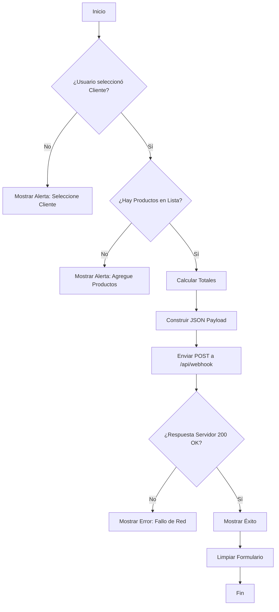
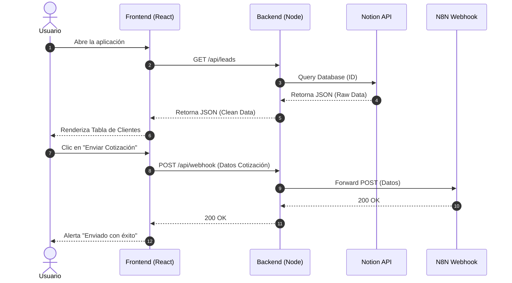
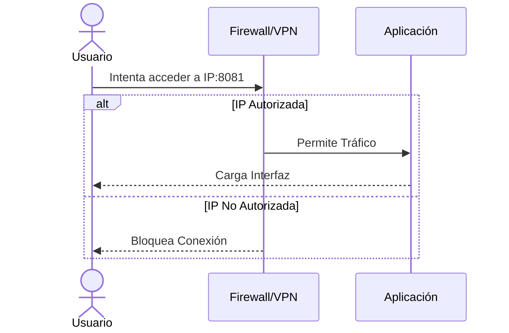
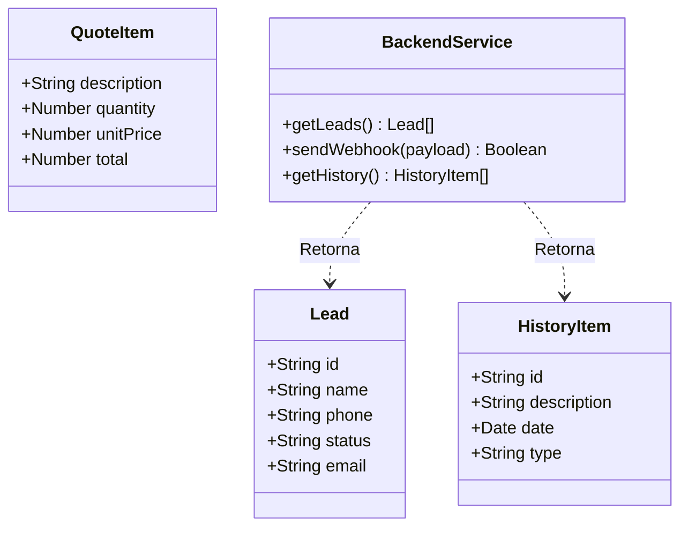
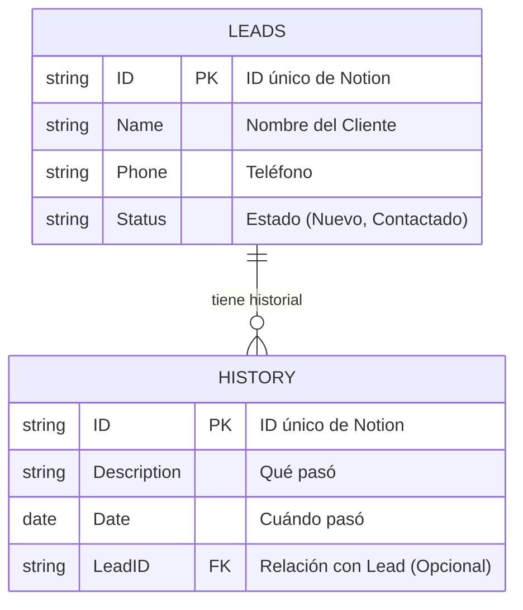
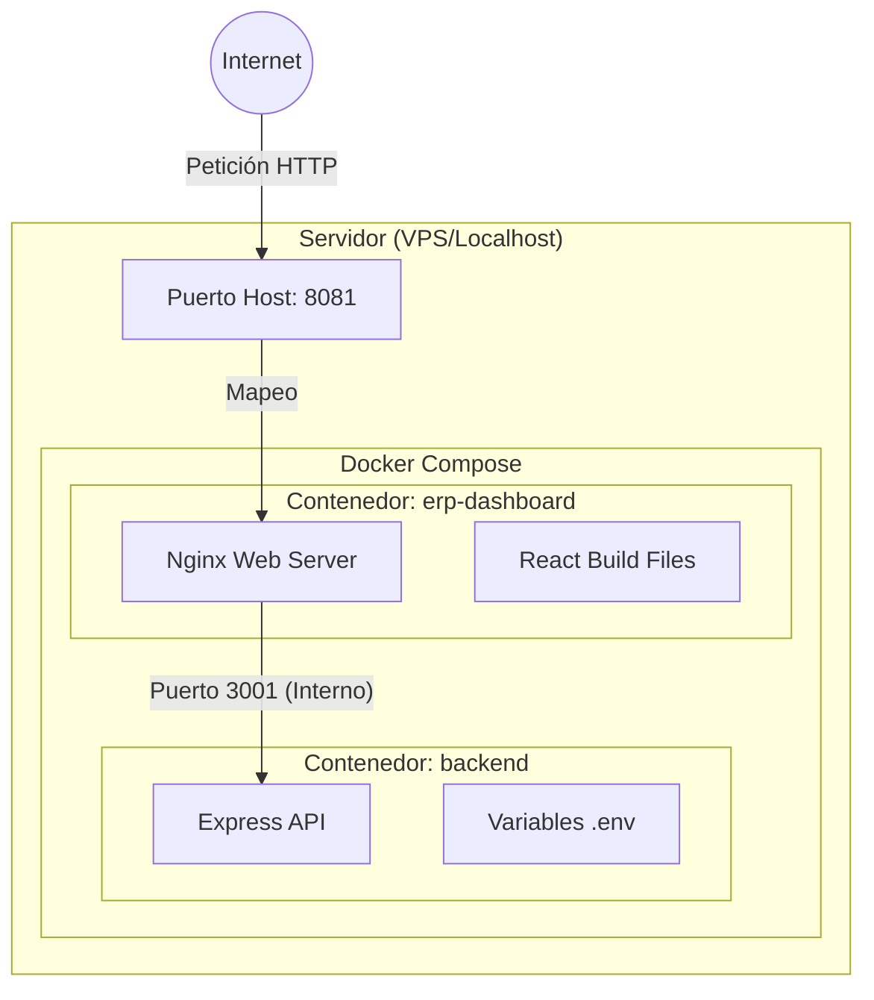

# BIBLIA DEL SISTEMA: DASHBOARD CON IA

Este documento tiene un único propósito: **Transferir todo el conocimiento técnico

> **Nota**: Se han añadido explicaciones simples entre paréntesis para aclarar términos técnicos.

---

## 1. Arquitectura Técnica Completa

El sistema es una aplicación web **Isomórfica de Microservicios** (que funciona igual en el servidor y cliente, dividida en pequeñas partes independientes) que actúa como interfaz personalizada sobre una base de datos NoSQL (Notion, que no usa tablas tradicionales como Excel, sino documentos flexibles).

### Diagrama de Componentes y Red

```mermaid
graph TD
    subgraph "Capa de Presentación (Cliente)"
        Browser[Navegador Usuario]
        React[React SPA (Aplicación de Página Única)]
        LocalStorage[Almacenamiento Local del Navegador]
    end

    subgraph "Capa de Infraestructura (Docker Host)"
        subgraph "Red Interna: app-network"
            Nginx[Nginx:80 (Portero / Gestor de Tráfico)]
            Node[Node.js:3001 (Cerebro / API Gateway)]
        end
    end

    subgraph "Capa de Datos y Servicios (SaaS - Software en la Nube)"
        Notion[Notion API (Donde se guardan los datos)]
        N8N[N8N Workflow (Robot de Automatización)]
    end

    Browser -- HTTPS/443 --> Nginx
    Nginx -- Proxy_Pass (Reenvío) --> Node
    Node -- HTTPS/JSON --> Notion
    Node -- HTTPS/JSON --> N8N
```

### Flujo de Ejecución Crítico

1.  **Inicialización**: `docker-compose` (herramienta para dirigir la orquesta de contenedores) levanta la red. Nginx espera en puerto 8081. Node espera en 3001.
2.  **Carga**: Usuario accede. Nginx sirve archivos estáticos (imágenes, código base). React "hidrata" (da vida e interactividad a) la vista.
3.  **Datos**: React pide `/api/leads` (solicita la lista de clientes). Nginx redirige a Node. Node firma la petición con `NOTION_API_KEY` (la contraseña maestra) y consulta Notion.
4.  **Transacción**: Usuario envía cotización. Node recibe POST (envío de datos), valida y reenvía a N8N (manda la tarea al robot y se olvida, conocido como "Fire-and-Forget").

---

## 2. Mapa del Código y Puntos Críticos

### Estructura de Archivos (El Mapa del Tesoro)

*   `docker-compose.yml`: **[CRÍTICO]** Define la red y las variables de entorno (configuraciones secretas). Si esto falla, nada arranca.
*   `nginx.conf`: **[CRÍTICO]** Configura el enrutamiento (las señales de tráfico). Un error aquí causa "404 Not Found" (Página no encontrada) en la API.
*   `backend/server.js`: **[NÚCLEO]** Contiene la lógica de seguridad. Es el único lugar que conoce los secretos.
    *   *Punto Caliente (Hotspot)*: La función `getHistory` tiene lógica de "fallback" (plan de respaldo) para fechas inválidas.
*   `src/components/QuotesView.tsx`: **[COMPLEJO]** Maneja el estado del formulario gigante.
    *   *Deuda Técnica (Trabajo pendiente/chapuza)*: El cálculo de totales se hace en el cliente (navegador). Debería validarse en el servidor para mayor seguridad.
*   `src/services/pdfService.ts`: **[FRÁGIL]** Genera el PDF a mano (coordenada X, Y). Si cambias el texto, debes recalcular las coordenadas manualmente.

---

## 3. Reglas de Negocio (Pseudocódigo - Lógica explicada simple)

### Regla 1: Validación de Envío
```pseudocode
SI (Cliente Seleccionado == NULO/VACÍO) O (Lista Productos == VACÍA):
    BLOQUEAR Envío
    MOSTRAR Alerta "Faltan datos"
SINO:
    PERMITIR Envío
```

### Regla 2: Sanitización de Fechas (El problema "Invalid Date")
*Sanitización: Limpiar datos sucios o erróneos para que no rompan el sistema.*
```pseudocode
ENTRADA: fecha_string (viene de Notion)
PROCESO:
    fecha_obj = PARSEAR(intentar leer fecha_string)
    SI fecha_obj ES INVÁLIDA (ej. "Mañana", "TBD"):
        RETORNAR "--:--"  // Fallback seguro (Plan B)
    SINO:
        RETORNAR FORMATO_ISO(fecha legible estándar)
```

### Regla 3: Persistencia de Leads
Los Leads **NO** se guardan en el servidor local. El servidor es "Stateless" (sin memoria a largo plazo). Si reinicias Docker (apagas y prendes), no se pierden datos porque viven en Notion (la nube).

---

## 4. Infraestructura: Docker y Redes

### Volúmenes y Persistencia
*Volumen: Disco duro virtual que sobrevive a reinicios.*
*   **Backend**: No usa volúmenes persistentes. Es efímero (si muere, renace limpio).
*   **Frontend**: No usa volúmenes. Se reconstruye en cada deploy (despliegue/actualización).
*   **Base de Datos**: Externa (Notion). No gestionamos su almacenamiento (disco duro).

### Redes
Docker crea una red virtual `default`.
*   `erp-dashboard` (Frontend) ve a `backend` por su nombre de host: `http://backend:3001`.
*   Desde fuera (tu PC), solo ves `localhost:8081`. El puerto 3001 está cerrado al exterior en producción (por seguridad).

---

## 5. Pipeline de Despliegue y Rollback

### Despliegue (Deployment - Poner en vivo)
1.  **Local**: `git push origin main` (Subir cambios a la nube de código).
2.  **Servidor**:
    ```bash
    git pull origin main       # Bajar cambios al servidor
    docker compose down        # Apagar sistema viejo
    docker compose up --build -d # Construir y prender sistema nuevo
    ```

### Rollback (Volver atrás - Deshacer cambios)
Si la nueva versión rompe todo:
1.  **Identificar commit anterior**: `git log` (ver historial, ej. código `a1b2c3d`)
2.  **Revertir código**: `git checkout a1b2c3d` (viajar en el tiempo a esa versión)
3.  **Redesplegar**:
    ```bash
    docker compose down
    docker compose up --build -d
    ```

---

## 6. Seguridad y Vectores de Ataque

### Modelo de Seguridad
*   **Autenticación**: **INEXISTENTE**. El sistema confía en que está en una red privada o protegido por VPN (Red Privada Virtual).
*   **Secretos**: Gestionados vía `.env` (archivo oculto). Nunca "hardcodeados" (escritos directamente en el código visible).

### Vectores de Ataque (Puntos débiles)
1.  **Acceso Público**: Si despliegas esto en una IP pública sin firewall (muro de fuego digital), CUALQUIERA puede ver tus clientes.
    *   *Mitigación*: Usar VPN o Basic Auth (usuario/contraseña básico) en Nginx.
2.  **DoS (Denegación de Servicio)**: Un script malicioso puede llamar `/api/leads` 1000 veces/segundo y bloquear tu cuenta de Notion.
    *   *Mitigación*: Implementar `express-rate-limit` (límite de velocidad) en `server.js`.
3.  **Inyección de Datos**: Notion limpia inputs, pero N8N podría ser vulnerable si no valida los datos del webhook (mensaje entrante).

---

## 7. Base de Datos (Esquema Notion)

Aunque flexible, el código espera esta estructura rígida:

| Tabla | Columna (Notion) | Tipo | Uso en Código |
| :--- | :--- | :--- | :--- |
| **Leads** | `Name` | Title | Nombre del Cliente |
| | `Phone` | Phone | Teléfono para WhatsApp |
| | `Status` | Select | Estado del Lead |
| **History** | `Description` | RichText | Detalle de la acción |
| | `Date` | Date | Timestamp (Marca de tiempo) del evento |

**Riesgo**: Si cambias el nombre de la columna "Name" a "Nombre" en Notion, **el sistema colapsa** (deja de funcionar).

---

## 8. Costos de Infraestructura

| Concepto | Costo Estimado | Notas |
| :--- | :--- | :--- |
| **VPS (Servidor Virtual)** | $5 - $10 USD/mes | DigitalOcean Droplet o AWS EC2 t3.micro |
| **Dominio** (.com) | $10 USD/año | Opcional (si usas IP directa es gratis) |
| **Notion** | Gratis / $10 USD | Gratis hasta cierto límite de bloques/API |
| **N8N** | Gratis (Self-hosted) | Si lo alojas en tu propio servidor |
| **Total** | **~$5 - $20 USD/mes** | Muy económico |

---

## 9. Deuda Técnica y Conocimiento No Documentado

### Lo que nadie te dice (hasta ahora):
1.  **Dependencia de N8N**: El chat y el envío de correos dependen 100% de que tu servidor de N8N esté vivo. Si N8N cae, el botón de "Enviar" parecerá funcionar pero no llegará nada.
2.  **PDF Frágil**: La generación de PDF usa coordenadas absolutas (píxeles exactos). Si el nombre del cliente es muy largo (más de 50 caracteres), se sobrepondrá al precio. No hay ajuste de texto automático.
3.  **Timezones (Zonas Horarias)**: Las fechas se guardan en UTC (Tiempo Universal) pero se muestran en local. Ojo con los reportes generados a medianoche; pueden salir con la fecha del día anterior.
4.  **Límite de Notion**: La API de Notion retorna máximo 100 items por página. El código actual maneja paginación (`hasMore`), pero si tienes 10,000 leads, la carga inicial tardará más de 10 segundos.

---

## 10. Monitoreo y Respuesta a Fallos

### Cómo saber si está vivo
*   **Comando**: `docker compose ps` (Debe decir "Up" / Encendido).
*   **Logs Backend**: `docker compose logs -f backend` (Busca errores rojos en el diario del sistema).
*   **Logs Nginx**: `docker compose logs -f erp-dashboard`.

### Protocolo de Emergencia
1.  **El sistema no carga**: Reinicia Docker (`docker compose restart`).
2.  **Error de API**: Verifica que la `NOTION_API_KEY` no haya expirado o sido revocada en Notion.
3.  **Botón no funciona**: Revisa la consola del navegador (F12) y verifica si hay errores de red (CORS o error 500 del servidor).

---

## 11. Diagramas Técnicos Detallados

A continuación se presentan los diagramas solicitados para la comprensión total del sistema.

### 11.1 Flowcharts (Diagramas de Flujo)

#### Proceso Principal: Envío de Cotización


#### Proceso de Error: Fallo en API Notion
```mermaid
flowchart TD
    A[Backend recibe petición /api/leads] --> B[Intentar conectar a Notion]
    B --> C{¿Conexión Exitosa?}
    C -- Sí --> D[Procesar Datos]
    C -- No --> E[Capturar Error (Catch)]
    E --> F[Loguear Error en Consola]
    F --> G[Responder 500 al Frontend]
    G --> H[Frontend recibe error]
    H --> I[Mostrar 'Error cargando datos' en UI]
```

### 11.2 Diagramas de Secuencia

#### Flujo de Datos Completo (Usuario -> Sistema -> Nube)


#### Inicio de Sesión (Implícito / Red)
*Nota: No hay login explícito. La seguridad es por red.*


### 11.3 Diagramas de Clases (Estructura de Datos)

Aunque JavaScript no tiene clases estrictas, estas son las interfaces de datos (Types) que usamos.



### 11.4 Diagrama Entidad-Relación (Base de Datos Notion)



### 11.5 Diagrama de Arquitectura de Infraestructura



---

**Fin del Manual Técnico Maestro.**
